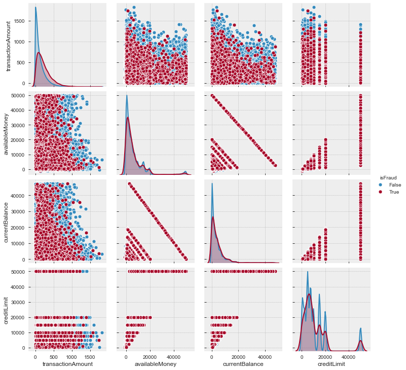
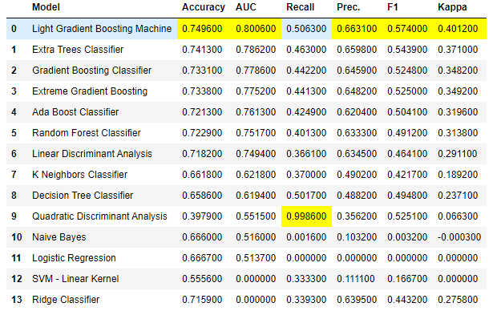
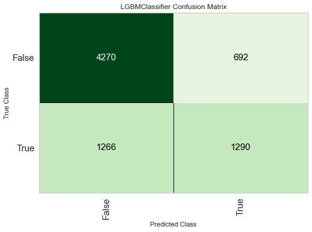
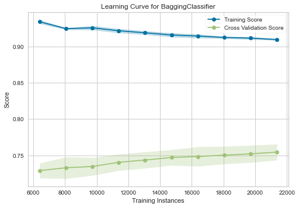
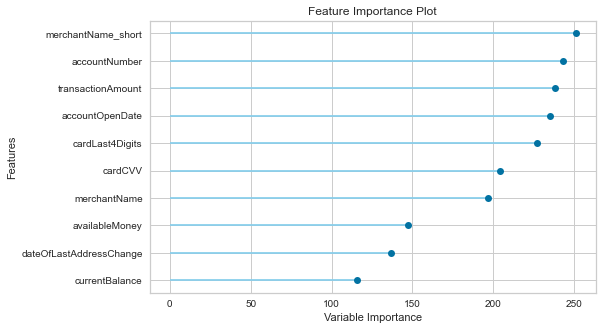
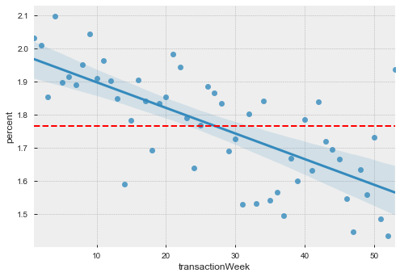

fraud-pycaret-demonstration
==============================

A short demonstration using PyCaret to tackle transaction fraud. 

The motivation for this project was to experiment with the (then new) PyCaret package to see how it compares with commonly used alternatives such as scikit-learn & xgboost.  

The following project contains an example data science workflow for a short project, conducting exploratory data analysis, and building machine learning modelling pipelines (and in this case, experimenting with the new PyCaret package).

\#python #pandas #matplotlib #seaborn #pycaret #jupyter #lightgbm #xgboost  

| Author 	| Benjamin Jones 	|
|--------	|----------------	|
| Date   	| 02/06/2020     	|



### Getting Started 

___If you don't want to run any of the code, skip to overview___

Got _docker?_ You can run the notebooks by running the following command from this root directory

```docker build -t yourusername/fraud-detection . ```
 
followed by

```docker run -p 8888:8888 yourusername/fraud-detection```

_Else_, to generate the environment, call ```tox -e develop``` from the terminal/command line in the project directory from a python 3.7 environment with ```tox``` installed. This creates a project specific virtual environment and installs the relevant packages. 

Once complete, activate the virtual environment with ```.\.venv\Scripts\activate``` on Windows or ```source .venv/bin/activate``` on a Mac. 

(Alternatively, calling ```pip install -r requirements.txt``` followed by ```python setup.py develop``` in a relevant virtual environment is sufficient).

\* you'll need a fully copy of transactions.txt in ```data/raw/transactions.txt```, I've included the first 100 rows for compatibility only

### Overview

The majority of this exercise exists in 2 notebooks:

```notebooks/eda.ipynb```
and

```notebooks/modelling.ipynb```

and has been built with a combination of ```pandas```, ```pandas_profiling```, ```seaborn```, and the new (as of April 2020) ```PyCaret``` package. 

There's also an html profiling report at ```reports/transactions_pandas_profiling.html``` and an example of non-notebook-style code in ```src/data/load_raw_data.py```

I recommend reading this readme summary report and the notebooks in that order.


_Why PyCaret?:_ 

I've been looking for an excuse to try this new package for a few weeks now and I figured this was a good opportunity and that it might interest the reader also.
PyCaret excels at fast prototyping, and is built on top of popular frameworks such as scikit-learn, XGBoost, Microsoft's LightGBM and spaCy, so it's a good choice for a time-limited assessment like this.
It's also very quick to deploy model pipelines on the cloud.

How did I find it? I was actually impressed with the ease of use and it does as it promises, but I found I was limited in my ability to configure even in this short task, and so for production workloads I wouldn't recommend it in its current form yet.

Typically, I would use scikit-learn or keras for this sort of task, and with more time I'd very much like to make the comparison between the three.  

_Why notebooks?:_ 

In my professional capacity I rarely use notebooks and usually write modules in an IDE (PyCharm is my IDE of choice) but for limited-time prototyping and reporting, notebooks are ideal. 
To demonstrate my usual coding style, I've abstracted the data ETL into the ```/src/data/load_raw_data.py``` DataLoader class (though in practice it's not strictly necessary here) and notebook utility function(s) in ```src/notebook_utilities.py```. 

## Summary

##### _Data Summary_

A comprehensive data summary can be found in the pandas_profiling output. Beyond that, an EDA analysis has been completed in EDA.ipynb 
 

##### _Model Performance Summary_

We tried a few models and the results of each, cross-validated over 5 folds are shown below. 

We see that tree-based ensemble models do relatively well, and I suspect this is at least in part because of the high number of categorical variables (but in my experience they are generally a good choice for most problems).

As a result, we chose to use LightGBM as our model of choice. It's not a huge surprise that Microsoft's LightGBM dominates here, as it frequently tops the rankings in Kaggle competitions. It's also a good choice for computation time.

We focus on AUC here rather than accuracy, as the dataset is highly imbalanced and we downsample to a ratio of 2:1 (0s:1s).



The confusion matrix for the lightGBM model on our holdout set isn't perfect, and here we can see the precision is significantly better than the recall. 



The learning curve shows that there's a steady increase in predictive ability as the sample size increases, suggesting more data would improve the predictive power.



The feature importances show our engineered feature is top (an aggregation of merchant names, more of this in the notebooks), followed by ```accountNumber``` and ```transactionAmount```. We broadly expected ```transactionAmount``` and ``merchantName`` to be significant given the distributions, and ``accountNumber`` confirms that each row in each account is not independent. 

```accountOpenDate``` however is unexpected and we'd like to do more investigation as to what drives the predictive ability here (unless it's simply correlated with accountNumber).



##### How much can we trust these results?

The model appears robust and has very low variance across folds, as well as similar performance with test and out-of-time holdout data (~0.81 AUC vs 0.80 AUC respectively).

However, we don't group by account number before we cross folds, which may contribute to contamination should it be desirable that all new predictions are on _unseen_ accounts.

The feature importances vary between PyCaret's implementation and SHAP - to understand why I'd need to know a little more about how PyCaret calculates Feature Importance. This isn't necessarily unexpected, as different importance metrics can have large differences, but it may also indicate a discrepancy in the results.

.
##### _Solution_
_Assumptions_

We assumed account numbers were allowed across train/test splits (we were allowed to have seen that account before)

We of course assume the target variable is accurate and has no noise when making our evaluation. 

~~We assumed the overall behaviours are constant in time~~  We investigated this assumption and it turned out to be false, there's a sizeable dependence on time (which went into one of our engineered features).



_Conclusions about your solution_ 

Overall, I think the lgbm model is optimised reasonably well given the dataset, and while we see some increase with the learning curve, in my opinion is likely _information_ limited. This means more focus should go on engineering additional features rather than selecting more complicated models or tuning hyperparameters (though this is dependent on PyCaret's hyperparameter tuning ability, which if I'm honest I'm a little sceptical of and would expore further given more time). 


_Steps to explore in further analysis_

* One of the largest challenges here is the dataset imbalance. Because the dataset is relatively large, we undersampled the majority class, but it might be interesting to use an oversampling method like SMOTE to use more of the majority class data.

* Another is the high presence and information contained in the categorical variables. Categorical encoding is vital here, and I'd have liked a bit more time to experiment with the different options here. In particular, entity embeddings such as those described here (https://arxiv.org/pdf/1604.06737.pdf) produce very good results for variables with hidden intrinsic properties (such as MerchantName).

* A list of further analyses and avenues for feature engineering can be found in the EDA notebook summary.


* Optimise for recall as the expense of precision (we'd likely rather not miss instances of fraud and over classify than vice versa)


---
Feedback always welcome. 

@btjones-me


<p><small>Project based on the <a target="_blank" href="https://drivendata.github.io/cookiecutter-data-science/">cookiecutter data science project template</a>. #cookiecutterdatascience</small></p>

